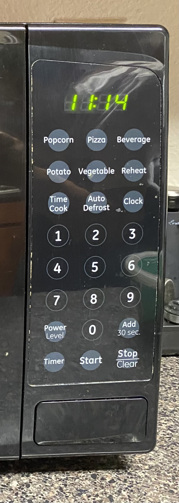
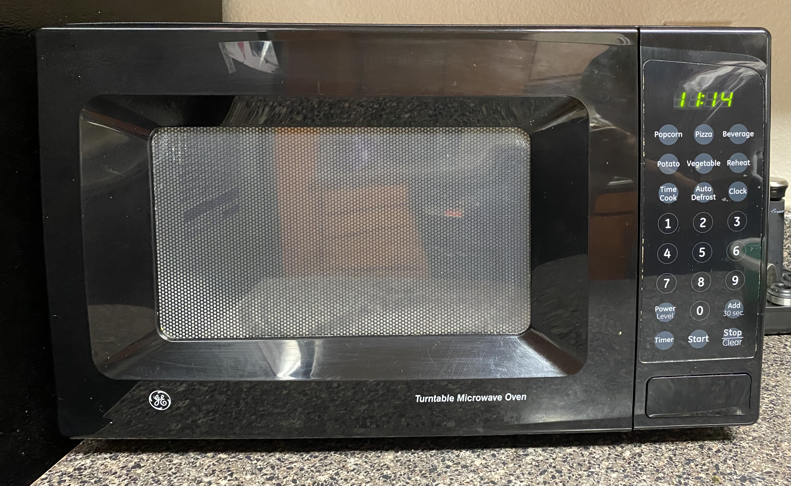
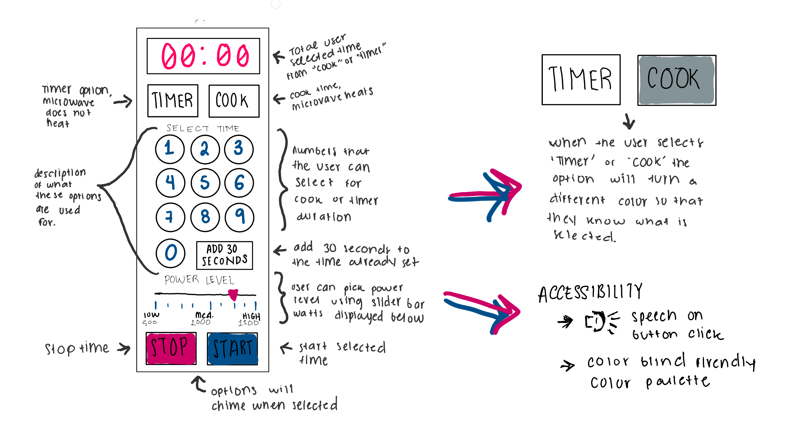

# Emily Quintanilla - CS4331 Human Computer Interaction, Project #1: Microwave Interface

## Project Link:
  -[Emily Quintanilla Project 1](https://emilyqelizabeth.github.io/p1EmilyQuintanilla/)

## Report:
#### **Bad Microwave Interface:**
  
  

#### **Bad Interface in Operation:**
  

#### **Issues + Why is is Bad:**
  - I think this is a bad interface because:
  1. Unless you have used a microwave before, button uses are unclear
  2. Clock and power level should have more instructions for the user
  3. There are too many options for pre-set cooking times
     1. It doesn't say how long the times are
  4. I don't think a clock on a microwave is necessary
  5. Does not support people with disabilities
     1. There is no option to hear button choices
     2. No braille
  6. Overall the interface needs more description

#### **Common + Rare Microwave Uses. How Does the Interface Make it Easier?**
  #### Common Microwave Uses:
  - Re-warm food
  - Cook food
  - Heat liquids
  #### Rare Microwave Uses:
  - Heating fabric items
  - Clean/sterilize items
  - Extra stroage for things such as bread when not in use
  - As a clock
  - As a timer

#### **How the Interface Makes These Uses Easier:**
  - The interface is especially helpful to a user if they are cooking food in their microwave from scratch.
  - The interfae allows the user to fully customize how they cook by setting the time and changing the power level
  
#### **How Does a User Interact With a Microwave? List Common Sequences of Actions:**
  1. User places food into the microwave
  2. User selects desired cook time
     1. Pressing numbers to choose time
     2. Using pre-set buttons such as 'popcorn'
  3. User presses start button
  4. After time is up, user will either
     1. Stop time before it completely ends or when it starts beeping
     2. Open microwave/pause time and remove food
      
#### **How Does the Interface Help the User Figure Out How to Work the Microwave:**
  - Buttons usually have names or numbers on them, telling the user what they are used for
  - The that aren't specifically labeled are usually figured out using ones intuition
  
#### **How Does the Microwave Provide Feedback to the User?**
  - The microwave provides feedback to the user through the time and sounds
  - When buttons are clicked, usually the microwave will make a chime noise
  - When the food is done being cooked it will chime
  - The user will see a time countdown on the clock area telling them how much longer their food is being cooked for, or their selected cooking time.
  
#### **What Are Some Common Mistakes You Can Make With This Current Design?**
  - There are too many options to use with the same set of numbers. If someone doesn't know about how to customize these settings, they may make mistakes when cooking.
  - The corresponding customizable time/number options include 'Time Cook', 'Clock', 'Power Level', 'Timer'
  - The user may make the mistake of undercooking or overcooking their food if they us the pre-set cooking options, as they do not tell the user the power level or cooking time.
  - The pre-set cooking options include 'Popcorn', 'Pizza', 'Beverage', 'Potato', 'Vegetable'
 
#### **Improvements to Make on the Control Interface:**
  - The control interface could be significantly improved by:
    1. Removing unncesessary pre-set cooking options
    2. 1. Limiting the cooking options
    3. Adding more description to the controls
    
#### **Low-Fidelity Prototype Sketch:**
  

#### **Touch Screen Design - Screen Size:**
  - 500 x 1060

#### **Interactive Features:**
  - Timer Button 
    - This button allows for the user to select a time without the microwave heating
  - Cook Button
    - This button allows for the user to select a time to cook/warm an item, where the microwave will heat
  - Number Buttons 
    - Numbers 0-9 for the user to customize Timer and Cook times
  - Add 30 Seconds Button
    - Adds 30 seconds to total selected time on either the Timer or Cook option
  - Power Level Slider
    - Allows the user to customize the wattage they want their food cooked with. Utilizes a slider bar to give the user a power range
  - Start Button
    - Start button starts the timer or cook options based off time chosen
  - Stop Button
    - Stop button stops the timer or cook options
  - Mute Button
    - Stops the microwave from using the text to speech feature

#### **How My Design Supports Disabilities:**
  - My design supports disabilites in many ways:
    1. _Colorblind friendly color pallete_, utilizing the colors blue, pink, black, and gray. They maintain the contrast enough to remain visible to different types of colorblindness
    2. _Text to Speech_, is utilized everytime a user clicks a button on the interface. The feature can be toggled on/off using the mute button. This feature is especially helpful to visually impared users

#### **User Feedback:**
  - Feedback is given to the user in a few different ways:
     1. The microwave will chime on button clicks and when the timer or cook options have finished
     2. The time on the clock will change as numbers in the 'Select Time' section are clicked on
     3. The buttons 'Timer', 'Cook', 'Mute', will change color upon selection so that the user knows that those will be used/are in use

## **UX Design**

## **Gif of Final Interface:**
