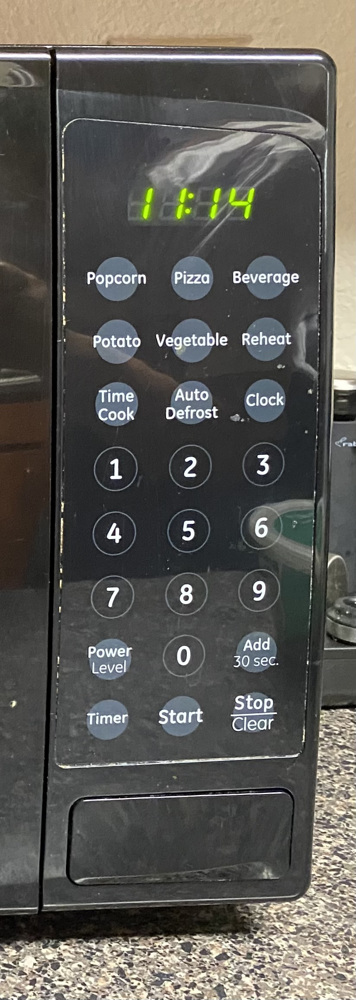

# Emily Quintanilla - CS4331 Human Computer Interaction, Project #1: Microwave Interface

## Project Link:
  -[Emily Quintanilla Project 1](https://emilyqelizabeth.github.io/HCI_Project1/)

## Report:
#### Bad Microwave Interface:
    

#### Bad Interface in Operation:

#### Issues + Why is is Bad:
    -I think this is a bad interface because:
      1. Unless you have used a microwave before, button uses are unclear
      2. Clock and power level should have more instructions for the user
      3. There are too many options for pre-set cooking times
        a. It doesn't say how long the times are
      4. I don't think a clock on a microwave is necessary
      5. Does not support people with disabilities
        a. There is no option to hear button choices
        b. No braille
      6. Overall needs more description

#### Common + Rare Microwave Uses. How Does the Interface Make it Easier?
  ###### Common Microwave Uses:
    -Re-warm food
    -Cook food
    -Heat liquids
  ###### Rare Microwave Uses:
    -Heating fabric items
    -Clean/sterilize items
    -Extra stroage for things such as bread when not in use
    -As a clock
    -As a timer

#### How the Interface Makes These Uses Easier:
    -The interface is especially helpful to a user if they are cooking food in their microwave from scratch.
    -The interfae allows the user to fully customize how they cook by setting the time and changing the power level
  
#### How Does a User Interact With a Microwave? List Common Sequences of Actions:
    1. User places food into the microwave
    2. User selects desired cook time
      a. Pressing numbers to choose time
      b. Using pre-set buttons such as 'popcorn'
    3. User presses start button
    4. After time is up, user will either
      a. Stop time before it completely ends or when it starts beeping
      b. Open microwave/pause time and remove food
      
#### How Does the Interface Help the User Figure Out How to Work the Microwave:
    -Buttons usually have names or numbers on them, telling the user what they are used for
    -The that aren't specifically labeled are usually figured out using ones intuition
  
#### How Does the Microwave Provide Feedback to the User?
    -The microwave provides feedback to the user through the time and sounds
    -When buttons are clicked, usually the microwave will make a chime noise
    -When the food is done being cooked it will chime
    -The user will see a time countdown on the clock area telling them how much longer their food is being cooked for, or their selected cooking time.
  
#### What Are Some Common Mistakes You Can Make With This Current Design?
    -There are too many options to use with the same set of numbers. If someone doesn't know about how to customize these settings, they may make mistakes when cooking.
    -The corresponding customizable time/number options include 'Time Cook', 'Clock', 'Power Level', 'Timer'
    -The user may make the mistake of undercooking or overcooking their food if they us the pre-set cooking options, as they do not tell the user the power level or cooking time.
    -The pre-set cooking options include 'Popcorn', 'Pizza', 'Beverage', 'Potato', 'Vegetable'
 
#### Improvements to Make on the Control Interface:
    -The control interface could be significantly improved by:
      1. Removing unncesessary pre-set cooking options
      2. Limiting the cooking options
      3. Adding more description to the controls
    
#### Low-Fidelity Prototype Sketch:

#### Touch Screen Design - Screen Size:

#### Interactive Features:

#### How My Design Supports Disabilities:

#### User Feedback:

#### Extra Useful Information on the Display Interface:

#### Processing

#### Gif of Final Interface:
